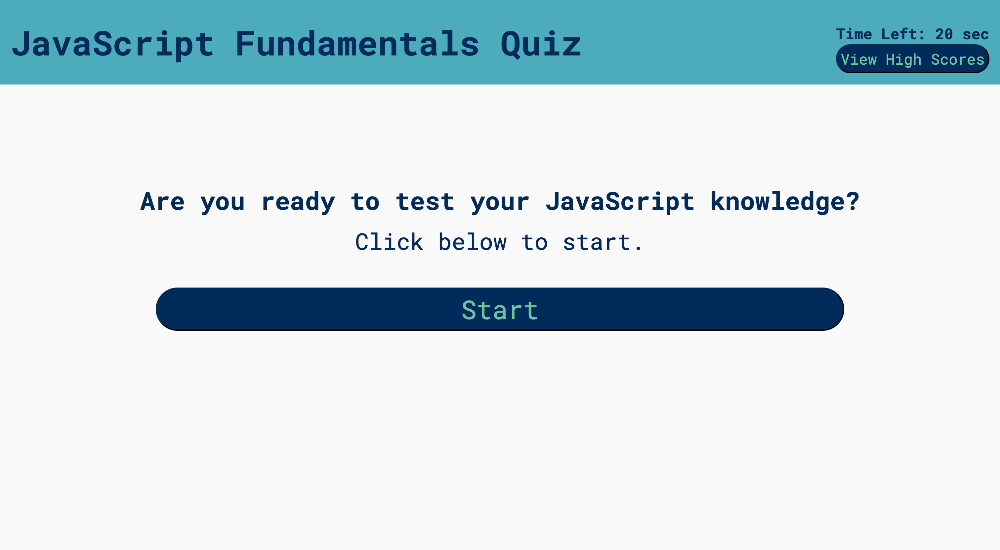
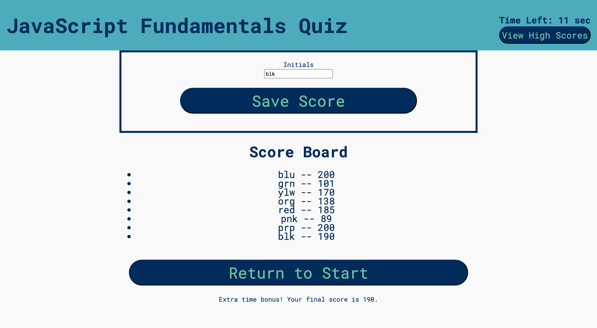

# timed-quiz-JS-fundamentals

## About

This application is a timed multiple-choice quiz on JavaScript fundamentals.

Users are presented with a start button that initiates the game timer. Questions are displayed one at a time. After each question, users receive feedback and a score update. Answering incorrectly deducts 3 seconds from the game clock. Finishing with remaining time on the clock adds bonus points of time left x 5.

When the time runs out or the user reaches the end, a scoreboard is presented displaying stored past user scores and initials. The user can save her/his score and initials or return to start to play again.

## Screenshots

## Deployed Application Link

https://relero90.github.io/timed-quiz-JS-fundamentals/
